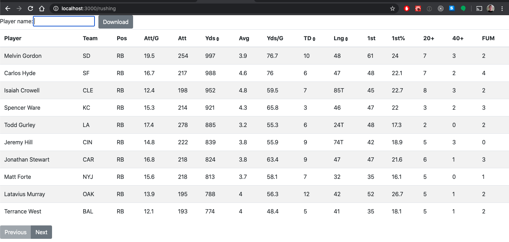

# theScore "the Rush" Interview Challenge
Here is a quick demo of the main page with no filtering or sorting:

## Background
We have sets of records representing football players' rushing statistics. All records have the following attributes:
* `Player` (Player's name)
* `Team` (Player's team abbreviation)
* `Pos` (Player's postion)
* `Att/G` (Rushing Attempts Per Game Average)
* `Att` (Rushing Attempts)
* `Yds` (Total Rushing Yards)
* `Avg` (Rushing Average Yards Per Attempt)
* `Yds/G` (Rushing Yards Per Game)
* `TD` (Total Rushing Touchdowns)
* `Lng` (Longest Rush -- a `T` represents a touchdown occurred)
* `1st` (Rushing First Downs)
* `1st%` (Rushing First Down Percentage)
* `20+` (Rushing 20+ Yards Each)
* `40+` (Rushing 40+ Yards Each)
* `FUM` (Rushing Fumbles)

In this repo is a sample data file [`rushing.json`](/rushing.json).

## Basic App Structure
The backend of the server is a Rails 6 application using Ruby 2.7
The frontend of the server is written in React, backed by Redux.

## Primary backend route

## Installing and Running

## Running Tests

## Design Decisions

## Future Improvements
* Dockerizing the environment and startup. That would make management and startup much less manual
* More extensive and explicit React testing, especially more complete Redux testing. The crux of the front-end logic is in the actions and reducers
* Implement debouncing for the query search (could be done through a delay). It can be expensive to kick off a request per query change
